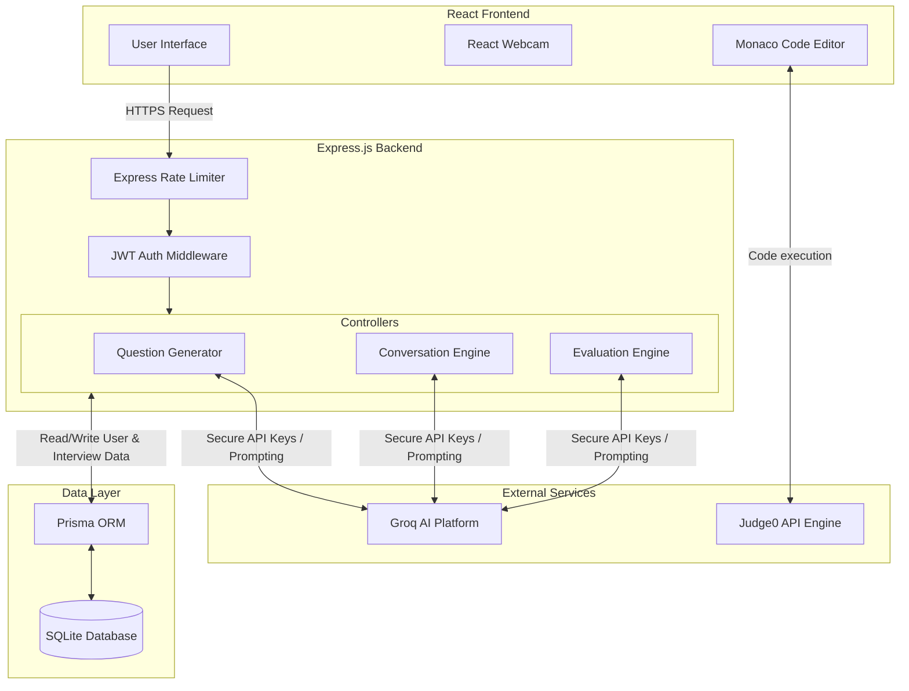

# InterviewMate: AI-Powered Technical Interview Simulator

An intelligent mock interview platform designed to simulate real-world technical, HR, coding, and system design interviews. The system leverages large language models (LLMs) to provide dynamic question generation, real-time conversational interviewing, and comprehensive performance analytics.

<div align="center">


</div>

<br/>

<details>
<summary><strong>Table of Contents</strong> (Click to expand)</summary>

1. [Project Overview](#1-project-overview)
2. [System Architecture](#2-system-architecture)
3. [Key Features](#3-key-features)
4. [Technology Stack](#4-technology-stack)
5. [Local Development Setup](#5-local-development-setup)
6. [Current Progress & Roadmap](#6-current-progress--roadmap)
7. [Author](#7-author)

</details>

---

## 1. Project Overview

Preparing for technical interviews requires consistent practice and actionable feedback. InterviewMate acts as a virtual interviewer by providing a complete, end-to-end interview lifecycle:

- **Dynamic Question Generation:** Questions are tailored to the candidate's chosen role, experience level, and difficulty.
- **Interactive Mock Interviews:** Simulates a conversational flow with follow-up questions based on the candidate's previous answers.
- **Automated Evaluation:** Uses LLMs to holistically grade communication skills, technical accuracy, and problem-solving abilities.
- **Integrated Coding Environment:** Includes an embedded code editor for Data Structures & Algorithms (DSA) rounds.

---

## 2. System Architecture

InterviewMate employs a robust Client-Server architecture designed for scalability, low-latency AI inference, and strict data security. 

### Data Flow Diagram



### Architectural Highlights:
<details>
<summary><strong>1. Secure Frontend-Backend Communication</strong></summary>
The React client communicates with the Express API via Axios. All protected routes are secured using **JSON Web Tokens (JWT)** stored securely in **HttpOnly Cookies**, rendering them immune to Cross-Site Scripting (XSS) attacks. CORS is strictly limited to permitted origins.
</details>

<details>
<summary><strong>2. AI Orchestration Layer</strong></summary>
The backend controllers orchestrate interactions with the **Groq API** (using open-source LLMs like `gpt-oss-120b`). Instead of directly exposing the AI to the client, the backend acts as a proxy—injecting highly engineered system prompts (e.g., persona configuration, scoring rubrics) before sending the candidate's input to the model. This guarantees prompt integrity and prevents abuse.
</details>

<details>
<summary><strong>3. Database Management</strong></summary>
**Prisma ORM** provides a type-safe abstraction over the **SQLite** relational database. This allows for complex relation mapping between Users, Interview Sessions, Chat Histories, and Final Evaluations, while preventing SQL injection out-of-the-box.
</details>

<details>
<summary><strong>4. Built-in Security Hardening</strong></summary>
The architecture includes strict **API rate-limiting** to prevent Denial-of-Service (DoS) and AI API spam. Furthermore, JSON payload size validation and a global error boundary ensure that unhandled backend crashes gracefully fail without exposing internal stack traces to the end user.
</details>

---

## 3. Key Features

- **Secure Authentication:** Implements JWT-based authentication using HTTP-only cookies to prevent XSS attacks.
- **AI-Driven Logic:** Integrates with the Groq API for ultra-fast, context-aware interview simulations.
- **Webcam Integration:** Simulates a proctored or live interview environment.
- **Security Hardened:** Features strict API rate-limiting, CORS origin restrictions, global error handling, and JSON payload limits to prevent abuse and data leakage.
- **Coding Assessments:** Embedded Monaco Editor for live coding problem solving.

---

## 4. Technology Stack

**Client-Side (Frontend)**
- React.js (Vite)
- Tailwind CSS
- Monaco Editor
- React Webcam

**Server-Side (Backend)**
- Node.js & Express.js
- Prisma ORM
- JSON Web Tokens (JWT) & bcrypt
- Express Rate Limit

**Database & External Services**
- SQLite (Development)
- Groq AI API

---

## 5. Local Development Setup

### Prerequisites
- Node.js (v16 or higher)
- npm or yarn

### Installation Steps

1. **Clone the Repository**
   ```bash
   git clone https://github.com/vinn31-git/Interview-Platform-AI.git
   cd Interview-Platform-AI
   ```

2. **Configure Environment Variables**
   Navigate to the `Phase2` directory and create a `.env` file with the following variables:
   ```env
   DATABASE_URL="file:./dev.db"
   JWT_SECRET="your_secure_random_string_here_min_32_chars"
   GROQ_API_KEY="your_groq_api_key_here"
   FRONTEND_URL="http://localhost:5173"
   ```

3. **Start the Backend Server**
   ```bash
   cd Phase2
   npm install
   npx prisma generate
   npx prisma db push
   npm run dev
   ```

4. **Start the Frontend Client**
   Open a new terminal window:
   ```bash
   cd Phase1
   npm install
   npm run dev
   ```

---

## 6. Current Progress & Roadmap

- **Completed:** JWT Authentication, AI Question Generation, Conversational Interview Engine, Automated Evaluation, Database Schema (SQLite), Security Hardening.
- **In Progress:** Judge0 Compiler Integration for executable code validation.
- **Planned:** Speech-to-Text Recognition for verbal answers, comprehensive Analytics Dashboard for tracking historical performance.

---

## 7. Author

**Sahasra**  
GitHub: [vinn31-git](https://github.com/vinn31-git)
